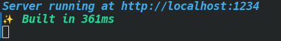

# snake_game
## Встановлення (UA)
Спочатку зайдіть у потрібну вам директорію та склонуйте репозиторій:
```bash
cd ./Downloads/
git clone https://github.com/goryan2101/snake_game
```
Потім пропишіть цю команду:
```bash
npm install
```
Щоб запустити проект пропишіть це:
```bash
npx parcel ./index.html
```
Це вам виведе отаке:



Вставте це посилання у браузер та насолоджуйтесь!

## Installation (EN)
First, clone the repository:
```bash
cd ./Downloads/
git clone https://github.com/goryan2101/snake_game
```
Next, type this:
```bash
npm install
```
To launch the project, type the command:
```bash
npx parcel ./index.html
```
Output:


Paste this URL in your browser and enjoy!